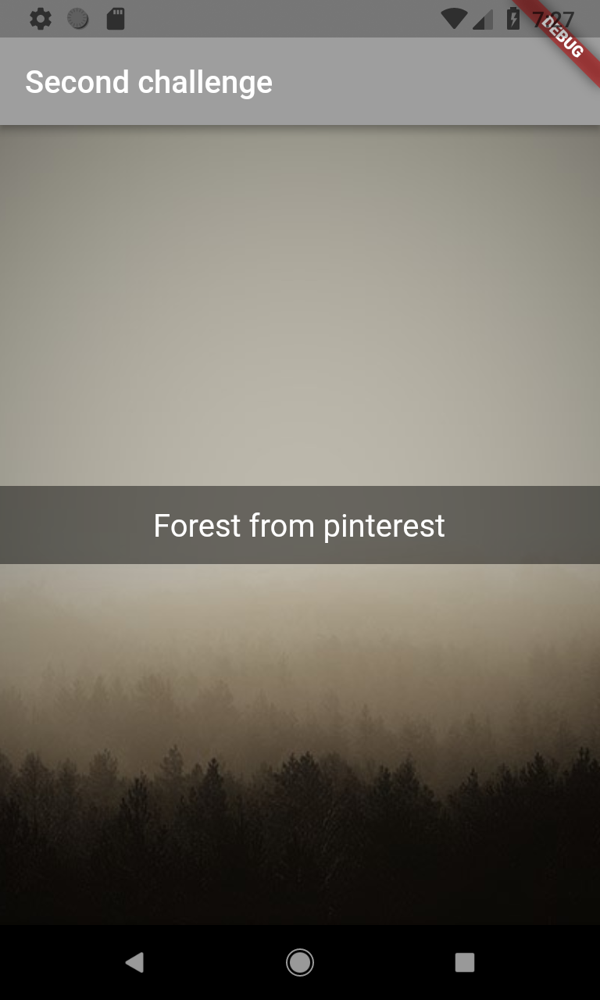

# text_full_background_image

In the background we have an image and above a black container that has a transparency over it is the Text. These last two are centered

## Getting Started

This project is a challenge to introduce widgest in fluter

A few resources to get  started if this is your first Flutter project:

- [Introduction to widgets](https://flutter.io/docs/development/ui/widgets-intro)
- [BoxDecoration class](https://docs.flutter.io/flutter/painting/BoxDecoration-class.html)

For help getting started with Flutter, view our 
[online documentation](https://flutter.io/docs), which offers tutorials, 
samples, guidance on mobile development, and a full API reference.

## Result:

 
